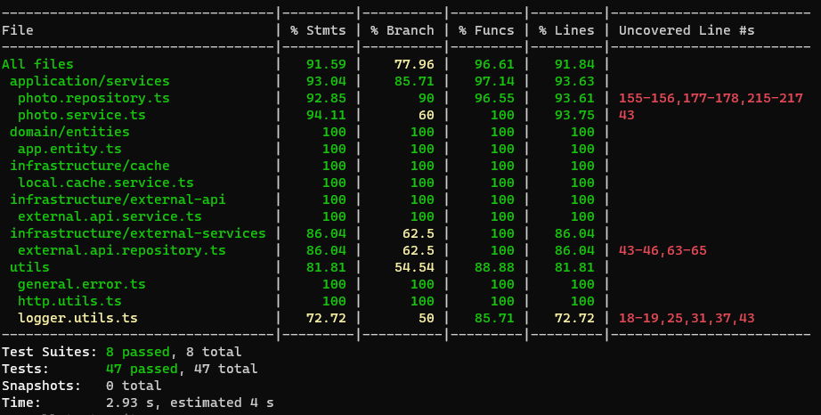

# RestFul API

This project is a RESTful API developed using Express.js and Typescript, designed to facilitate ETL (Extract, Transform, Load) processes. This service reduces the latency and limitations of the throughput of multiple requests and mobile devices.

# Local cache

To enhance performance and reduce the time required to execute HTTP requests, this API provides a local caching mechanism. The following configuration options are available:

- **LOCAL_CACHE_ENABLED:** Set to `true` to enable local caching, allowing the API to store responses locally.
- **LOCAL_CACHE_TTL:** Specifies the Time-To-Live (TTL) for cached data in seconds. This means the cached data will be considered valid for one minute before a new request is made to the external API.
- **LOCAL_CACHE_PATH:** Defines the directory where the locally cached JSON files will be stored in `tmp` directory. In this case, the directory. Adjust this path based on your local environment and preferences.

## Endpoints

1.  ### /ping [GET]

    - Designed for a quick evaluation of a `200 OK` response and string `PONG!`

2.  ### /health-check

    - Designed to provide a health status of the server, returning a `200 OK` response along with a JSON object that includes the server's uptime. This endpoint is ideal for monitoring and evaluating the continuous operation of the API.

3.  ### v1/external-api/photos [GET]

    - This endpoint allows you to retrieve photos from an external API.

    - Status Response:

      - `204`: No Content

      - `200`: Return json payload

      - `403`: Forbidden

- Query String:

  - **_title:_** Filters photos with the title.
  - **_album.title:_** Filters photos that belong to an album with the title.
  - **_album.user.email:_** Filters photos that belong to an album owned by a user with the email address.
  - **_offset:_** Specifies the offset for paginating results. In this case, default in 0.
  - **_limit:_** Specifies the maximum number of results to return, in this case, limiting the response to 25 items.

  #### Pagination Headers

  When interacting with this API, the server includes the following custom HTTP headers in the response to provide information about pagination:

  - **X-Pagination-Limit:** Indicates the maximum number of items that can be returned per page.
  - **X-Pagination-Offset:** Specifies the starting index or offset of the returned items.
  - **X-Pagination-Total:** Represents the total number of items available across all pages.
  - **X-Pagination-Pages:** Indicates the total number of pages available based on the specified limit.

4.  ### v1/external-api/photos/:photoID [GET]

    - This endpoint retrieves information about a specific photo identified by `:photoID` from an external API.

    - Status Response:

      - `204`: No Content

      - `200`: Return json payload

      - `403`: Forbidden

### Authentication

The endpoints in `v1` have a small authentication using the header `x-api-key` to provide a guarantee of correct access and limit the resources of the external and invalid devices.

## Environment Setup

Before running the server, make sure to set up the environment variables by creating a `.env` file based on the provided `env.example` file. Fill in the necessary information for external Service and the configuration:

```bash
; Application  service
API_PORT  =  NUMBER
API_VERSION  =  NUMBER
API_LOG_LEVEL  =  STRING
API_X_API_KEY  =  STRING


; External  API
EXTERNAL_API_URL  =  URL_STRING
EXTERNAL_API_USERS_ENDPOINT  =  ENDPOINT_STRING
EXTERNAL_API_ALBUMS_ENDPOINT  =  ENDPOINT_STRING
EXTERNAL_API_PHOTOS_ENDPOINT  =  ENDPOINT_STRING


; Local  cache
LOCAL_CACHE_ENABLED  =  STRING
LOCAL_CACHE_TTL  =  NUMBER
LOCAL_CACHE_PATH  =  STRING

```

## Testing

To run the tests for the server, use the following command:

```bash
npm  run  test
```

Coverage of testing has the project, follow this command:

```bash
npm  run  test:coverage
```



_The minimum accepted is 70%_

## Running the Application

Depending on your environment (local development or production), use the following commands to run the application:

### In Local Development

Use this command if you are running the application in a local development environment:

```bash

npm  run  start:dev

```

## Production:

```bash

npm  run  start

```

### Building the Application

If it's necessary to build the TypeScript files before running the application, use this command:

```bash

npm  run  build

```

## Documentation

Includes a Postman collection designed for ease of use and accessibility. The collection contains pre-configured requests for all the API endpoints in this project: [Collection](documentation/postman/relish-cc.postman_collection.json) and [EnvVars](documentation/postman/nucserver-local.postman_environment.json)
